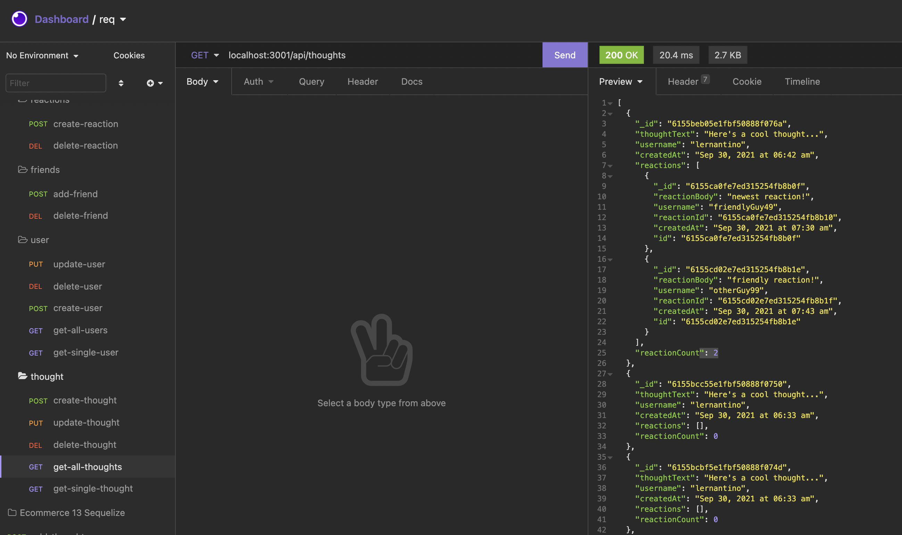

# social-networld-18

## Description 

This is a back-end application that is run in node.js, utilizing the Sequelize ORM to interact with the MySQL database. 

## Table of Contents

* [Installation](#installation)
* [Usage](#usage)
* [Credits](#credits)
* [License](#license)
* [Contributing](#Contributing)
* [Contact](#Contact)
* [Presentation](#Presentation)

## Installation
Direct your command line to the root folder of the application and run 'npm install' to install the needed dependencies /
Start MySQL server
 ### Technologies Used:
Node.js/
Express /
Moment /
MongoDB /
Mongoose 

  Insomnia API (external application software)

## Usage 

Start this app by opening the command line and executing 'npm start' or 'node server' \

Place routes into Insomnia, respectively, to retrieve desired data from the CRUD functions that the application operates. Refer to code comments for each route type in the "routes/api" folder to operate Insomnia with the appropriate route endpoints. 
                

## Credits

Thomas Walker 

## License

## Contributing

    

## Tests
No test modules were used in the build process of this application 

## Contact

 github.com/twalker7

 ## Presentation
 ### Attached is a link to video presentation for this application:

https://watch.screencastify.com/v/wWmm9k3rPsjnGfbC9op2